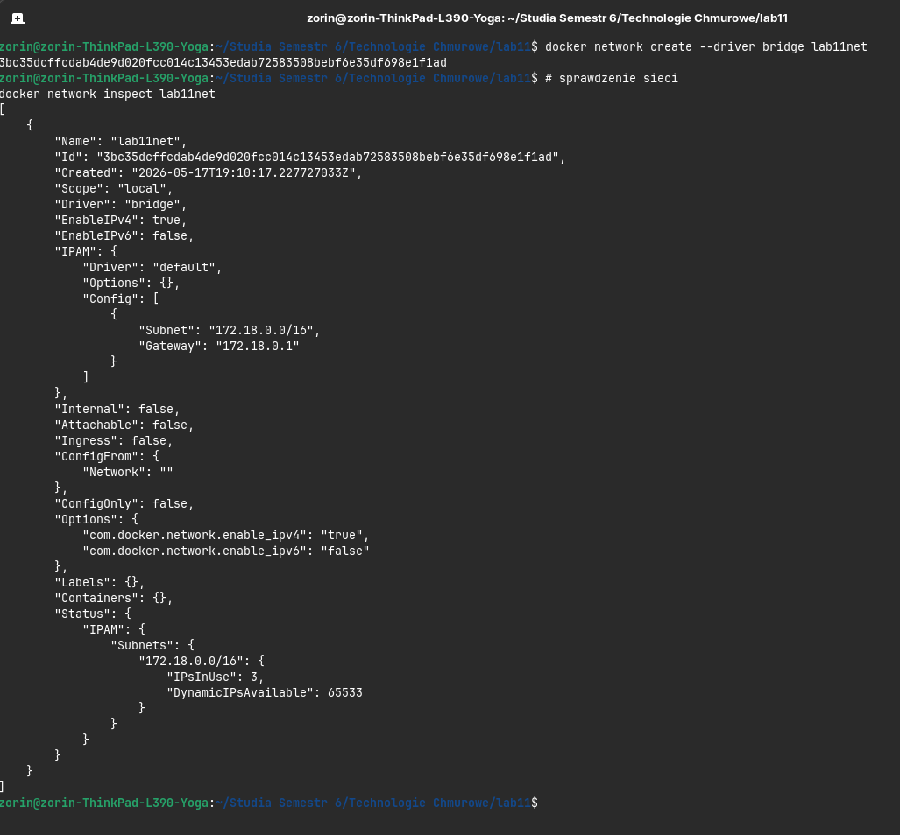
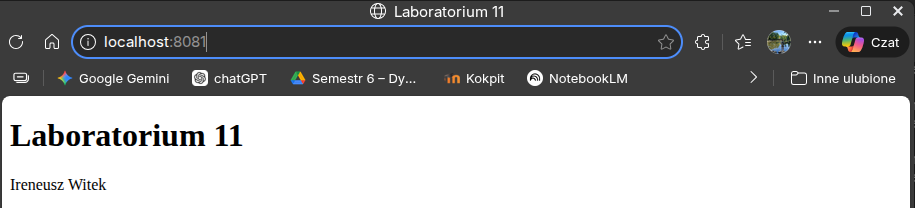
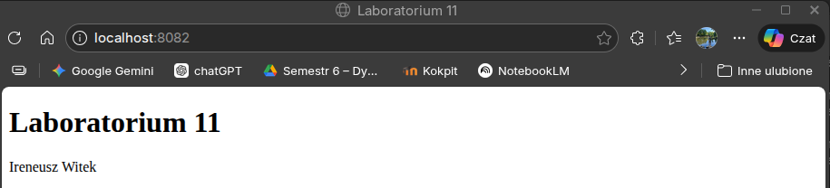
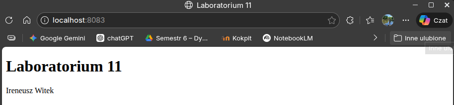
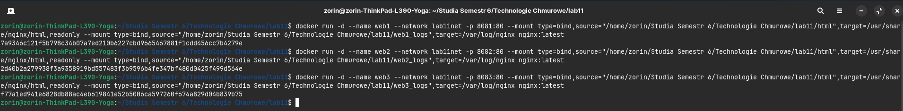
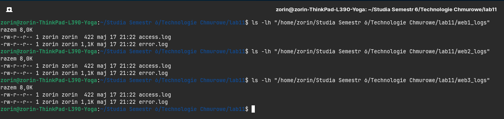

# Technologie Chmurowe — Laboratorium 11 #

## Autor: Ireneusz Witek ##

## Opis zadania: ##
Celem zadania było uruchomienie trzech kontenerów nginx połączonych wspólną siecią mostkową Docker oraz wykorzystujących bind mount do współdzielenia strony HTML i zapisywania logów na hoście.

## Tworzenie i sprawdzenie sieci lab11net: ##


## Utworzenie sieci Docker

```bash
docker network create --driver bridge lab11net
```
## Sprawdzenie sieci

```bash
docker network inspect lab11net
```

## Uruchomienie kontenera web1

```bash
docker run -d --name web1 --network lab11net -p 8081:80 --mount type=bind,source="/home/zorin/Studia Semestr 6/Technologie Chmurowe/lab11/html",target=/usr/share/nginx/html,readonly --mount type=bind,source="/home/zorin/Studia Semestr 6/Technologie Chmurowe/lab11/web1_logs",target=/var/log/nginx nginx:latest
```


## Uruchomienie kontenera web2

```bash
docker run -d --name web2 --network lab11net -p 8082:80 --mount type=bind,source="/home/zorin/Studia Semestr 6/Technologie Chmurowe/lab11/html",target=/usr/share/nginx/html,readonly --mount type=bind,source="/home/zorin/Studia Semestr 6/Technologie Chmurowe/lab11/web2_logs",target=/var/log/nginx nginx:latest
```


## Uruchomienie kontenera web3

```bash
docker run -d --name web3 --network lab11net -p 8083:80 --mount type=bind,source="/home/zorin/Studia Semestr 6/Technologie Chmurowe/lab11/html",target=/usr/share/nginx/html,readonly --mount type=bind,source="/home/zorin/Studia Semestr 6/Technologie Chmurowe/lab11/web3_logs",target=/var/log/nginx nginx:latest
```




## Sprawdzenie logów: ##

web1:
```bash
ls -lh "/home/zorin/Studia Semestr 6/Technologie Chmurowe/lab11/web1_logs"
```

web2:
```bash
ls -lh "/home/zorin/Studia Semestr 6/Technologie Chmurowe/lab11/web2_logs"
```

web3:
```bash
ls -lh "/home/zorin/Studia Semestr 6/Technologie Chmurowe/lab11/web3_logs"
```



